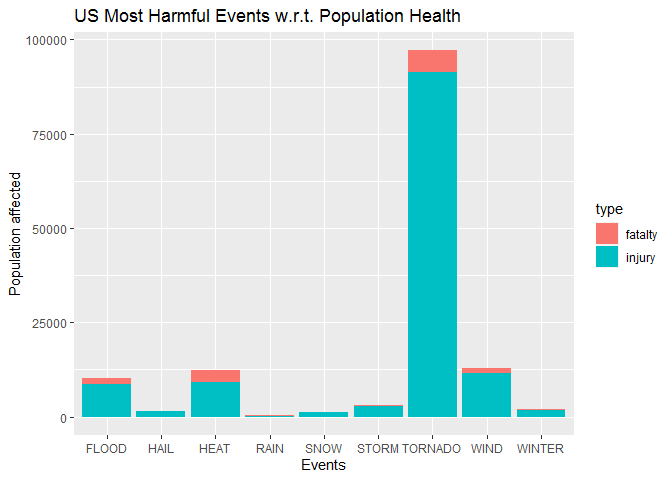
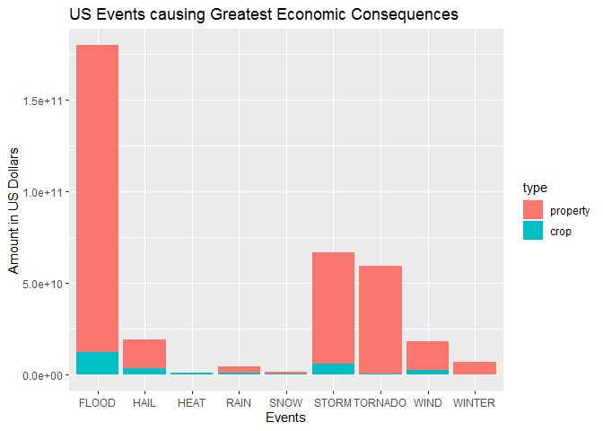

# Exploring the U.S. National Oceanic and Atmospheric Administration’s (NOAA) storm database - Health and Economic Impacts

      Storms and other severe weather events can cause both public health and economic problems for communities and municipalities. Many severe events can result in fatalities, injuries, and property damage, and preventing such outcomes to the extent possible is a key concern.

      This project involves exploring the U.S. National Oceanic and Atmospheric Administration's (NOAA) storm database. This database tracks characteristics of major storms and weather events in the United States, including when and where they occur, as well as estimates of any fatalities, injuries, and property damage.

      This report gives us a brief idea about the weather events in the United States that cause major destruction of life and property within the country.

## Data Processing

First, we download data from the NOAA storm database and load the same into R. 


```r
fileURL <- "https://d396qusza40orc.cloudfront.net/repdata%2Fdata%2FStormData.csv.bz2"
if(!dir.exists("./Data/")){
      dir.create("./Data/")
      download.file(fileURL, "./Data/data.csv.bz2")
}
stormData <- read.csv(bzfile("./Data/data.csv.bz2"))
```

## Transforming Dataset suitable for Analysis

      Now, we can see that for our analysis there are only a few columns of our interest which include the Event Type, Rate of Fatalities and Injuries, Damage to Crop & Property. We carefully subset the data required.
  
      We clean the dataset to classify events into appropriate categories. Then, we calculate the actual cost of damage to property and crops using the amount and values specified in the database.


```r
dataSet <- stormData[,c("EVTYPE","FATALITIES","INJURIES","PROPDMG","PROPDMGEXP","CROPDMG","CROPDMGEXP")]
str(dataSet)
```

```
## 'data.frame':	902297 obs. of  7 variables:
##  $ EVTYPE    : Factor w/ 985 levels "   HIGH SURF ADVISORY",..: 834 834 834 834 834 834 834 834 834 834 ...
##  $ FATALITIES: num  0 0 0 0 0 0 0 0 1 0 ...
##  $ INJURIES  : num  15 0 2 2 2 6 1 0 14 0 ...
##  $ PROPDMG   : num  25 2.5 25 2.5 2.5 2.5 2.5 2.5 25 25 ...
##  $ PROPDMGEXP: Factor w/ 19 levels "","-","?","+",..: 17 17 17 17 17 17 17 17 17 17 ...
##  $ CROPDMG   : num  0 0 0 0 0 0 0 0 0 0 ...
##  $ CROPDMGEXP: Factor w/ 9 levels "","?","0","2",..: 1 1 1 1 1 1 1 1 1 1 ...
```

```r
dataSet$EVENT[grepl("HAIL", dataSet$EVTYPE, ignore.case = TRUE)] <- "HAIL"
dataSet$EVENT[grepl("HEAT", dataSet$EVTYPE, ignore.case = TRUE)] <- "HEAT"
dataSet$EVENT[grepl("FLOOD", dataSet$EVTYPE, ignore.case = TRUE)] <- "FLOOD"
dataSet$EVENT[grepl("STORM", dataSet$EVTYPE, ignore.case = TRUE)] <- "STORM"
dataSet$EVENT[grepl("WINTER", dataSet$EVTYPE, ignore.case = TRUE)] <- "WINTER"
dataSet$EVENT[grepl("WIND", dataSet$EVTYPE, ignore.case = TRUE)] <- "WIND"
dataSet$EVENT[grepl("SNOW", dataSet$EVTYPE, ignore.case = TRUE)] <- "SNOW"
dataSet$EVENT[grepl("TORNADO", dataSet$EVTYPE, ignore.case = TRUE)] <- "TORNADO"
dataSet$EVENT[grepl("RAIN", dataSet$EVTYPE, ignore.case = TRUE)] <- "RAIN"
table(dataSet$EVENT)
```

```
## 
##   FLOOD    HAIL    HEAT    RAIN    SNOW   STORM TORNADO    WIND  WINTER 
##   82686  289270    2648   12241   17664    3668   60700  364853   19597
```

```r
head(dataSet$PROPDMGEXP)
```

```
## [1] K K K K K K
## Levels:  - ? + 0 1 2 3 4 5 6 7 8 B h H K m M
```

```r
head(dataSet$CROPDMGEXP)
```

```
## [1]      
## Levels:  ? 0 2 B k K m M
```

```r
dataSet$PROPDMGEXP <- as.character(dataSet$PROPDMGEXP)
dataSet$CROPDMGEXP <- as.character(dataSet$CROPDMGEXP)
#NA values as 10^0
dataSet$PROPDMGEXP[is.na(dataSet$PROPDMGEXP)] <- "0"
dataSet$CROPDMGEXP[is.na(dataSet$CROPDMGEXP)] <- "0"
#Everything except K, M & B as 10^0
dataSet$PROPDMGEXP[!(grepl("K|M|B", dataSet$PROPDMGEXP, ignore.case = TRUE))] <- "0"
dataSet$CROPDMGEXP[!(grepl("K|M|B", dataSet$CROPDMGEXP, ignore.case = TRUE))] <- "0"
#Thousands as 10^3
dataSet$PROPDMGEXP[grep("K", dataSet$PROPDMGEXP, ignore.case = TRUE)] <- "3"
dataSet$CROPDMGEXP[grep("K", dataSet$CROPDMGEXP, ignore.case = TRUE)] <- "3"
#Millions as 10^6
dataSet$PROPDMGEXP[grep("M", dataSet$PROPDMGEXP, ignore.case = TRUE)] <- "6"
dataSet$CROPDMGEXP[grep("M", dataSet$CROPDMGEXP, ignore.case = TRUE)] <- "6"
#Billions as 10^9
dataSet$PROPDMGEXP[grep("B", dataSet$PROPDMGEXP, ignore.case = TRUE)] <- "9"
dataSet$CROPDMGEXP[grep("B", dataSet$CROPDMGEXP, ignore.case = TRUE)] <- "9"
#Converting powers to Numeric Values
dataSet$PROPDMGEXP <- as.numeric(dataSet$PROPDMGEXP)
dataSet$CROPDMGEXP <- as.numeric(dataSet$CROPDMGEXP)
#Calculating actual damage
dataSet$property.damage <- dataSet$PROPDMG * 10^dataSet$PROPDMGEXP
dataSet$crop.damage <- dataSet$CROPDMG * 10^dataSet$CROPDMGEXP
str(dataSet)
```

```
## 'data.frame':	902297 obs. of  10 variables:
##  $ EVTYPE         : Factor w/ 985 levels "   HIGH SURF ADVISORY",..: 834 834 834 834 834 834 834 834 834 834 ...
##  $ FATALITIES     : num  0 0 0 0 0 0 0 0 1 0 ...
##  $ INJURIES       : num  15 0 2 2 2 6 1 0 14 0 ...
##  $ PROPDMG        : num  25 2.5 25 2.5 2.5 2.5 2.5 2.5 25 25 ...
##  $ PROPDMGEXP     : num  3 3 3 3 3 3 3 3 3 3 ...
##  $ CROPDMG        : num  0 0 0 0 0 0 0 0 0 0 ...
##  $ CROPDMGEXP     : num  0 0 0 0 0 0 0 0 0 0 ...
##  $ EVENT          : chr  "TORNADO" "TORNADO" "TORNADO" "TORNADO" ...
##  $ property.damage: num  25000 2500 25000 2500 2500 2500 2500 2500 25000 25000 ...
##  $ crop.damage    : num  0 0 0 0 0 0 0 0 0 0 ...
```

## Analysing the Final Results

      Perform analysis on the data to generate results(dividing the datasets into categories so that plotting can be done easily.) We categorise the dataset and aggregate the same for population health and economic damage and reshape the data so as to get a brief idea about the nature of the results. 


```r
data <- dataSet[,c("EVENT","FATALITIES","INJURIES","property.damage","crop.damage")]
str(data)
```

```
## 'data.frame':	902297 obs. of  5 variables:
##  $ EVENT          : chr  "TORNADO" "TORNADO" "TORNADO" "TORNADO" ...
##  $ FATALITIES     : num  0 0 0 0 0 0 0 0 1 0 ...
##  $ INJURIES       : num  15 0 2 2 2 6 1 0 14 0 ...
##  $ property.damage: num  25000 2500 25000 2500 2500 2500 2500 2500 25000 25000 ...
##  $ crop.damage    : num  0 0 0 0 0 0 0 0 0 0 ...
```

```r
fatalties <- tapply(data$FATALITIES, data$EVENT, sum)
fatalties <- data.frame(names(fatalties), "fatalty", fatalties, row.names = NULL)
names(fatalties) <- c("event","type","count")
injuries <- tapply(data$INJURIES, data$EVENT, sum)
injuries <- data.frame(names(injuries), "injury", injuries, row.names = NULL)
names(injuries) <- c("event","type","count")
populationHealth <- rbind(fatalties, injuries)
populationHealth
```

```
##      event    type count
## 1    FLOOD fatalty  1524
## 2     HAIL fatalty    15
## 3     HEAT fatalty  3138
## 4     RAIN fatalty   114
## 5     SNOW fatalty   164
## 6    STORM fatalty   206
## 7  TORNADO fatalty  5661
## 8     WIND fatalty  1420
## 9   WINTER fatalty   277
## 10   FLOOD  injury  8602
## 11    HAIL  injury  1371
## 12    HEAT  injury  9224
## 13    RAIN  injury   305
## 14    SNOW  injury  1164
## 15   STORM  injury  2900
## 16 TORNADO  injury 91407
## 17    WIND  injury 11455
## 18  WINTER  injury  1876
```

```r
propertyDamage <- tapply(data$property.damage, data$EVENT, sum)
propertyDamage <- data.frame(names(propertyDamage), "property", propertyDamage, row.names = NULL)
names(propertyDamage) <- c("event","type","amount")
cropDamage <- tapply(data$crop.damage, data$EVENT, sum)
cropDamage <- data.frame(names(cropDamage), "crop", cropDamage, row.names = NULL)
names(cropDamage) <- c("event","type","amount")
economicDamage <- rbind(propertyDamage, cropDamage)
economicDamage
```

```
##      event     type       amount
## 1    FLOOD property 167502193929
## 2     HAIL property  15733043048
## 3     HEAT property     20325750
## 4     RAIN property   3270230192
## 5     SNOW property   1024669752
## 6    STORM property  61080059960
## 7  TORNADO property  58593098029
## 8     WIND property  16131522052
## 9   WINTER property   6716795251
## 10   FLOOD     crop  12266906100
## 11    HAIL     crop   3046837473
## 12    HEAT     crop    904469280
## 13    RAIN     crop    919315800
## 14    SNOW     crop    134683100
## 15   STORM     crop   5739219500
## 16 TORNADO     crop    417461520
## 17    WIND     crop   2043974538
## 18  WINTER     crop     42444000
```

## RESULTS

      From our analysis, we can conclude that Tornado has the most severe effect on the health on the population causing the highest number of fatalities and injuries to the population than the rest.

Here is a plot verifying the results :


```r
library(ggplot2)
ggplot(populationHealth, aes(x = event, y = count, fill = type)) + geom_bar(stat = "identity") + xlab("Events") + ylab("Population affected") + ggtitle("US Most Harmful Events w.r.t. Population Health")
```

<!-- -->

      From our analysis, we can conclude that Floods cause the greatest destruction to crop & property which results in great economic losses for the nation.

Here is a plot verifying the results :


```r
library(ggplot2)
ggplot(economicDamage, aes(x = event, y = amount, fill = type)) + geom_bar(stat = "identity") + xlab("Events") + ylab("Amount in US Dollars") + ggtitle("US Events causing Greatest Economic Consequences")
```

<!-- -->

